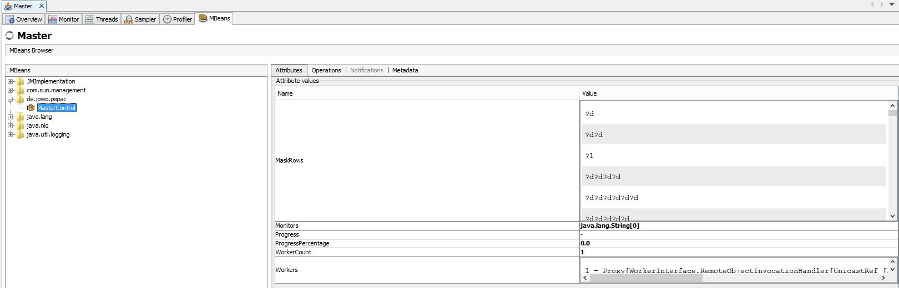
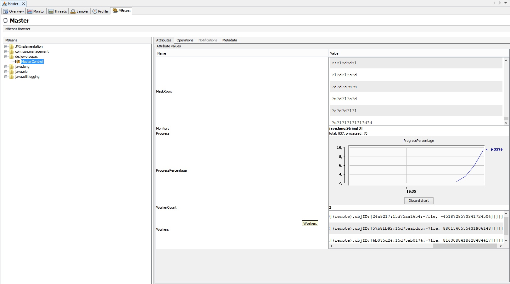
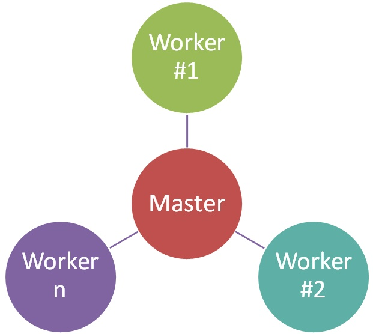

# Distributed Hashcat #
## Introduction ##
This project was created during my studies of "pspac" at the FAU Erlangen.
It's a simple framework to launch distributed "jobs", e.g. [hashcat](http://hashcat.net).

The jobs `de.jowo.pspact.jobs.HashcatJob` and `de.jowo.pspact.jobs.BatchHashcatJob` can be used to perform a [mask attack](https://hashcat.net/wiki/doku.php?id=mask_attack) using any number of nodes. 
Because any hashcat argument can be passed to the framework essentially [all hashes supported by hashcat](https://hashcat.net/hashcat/#features-algos) can be cracked. 

## Usage ##
For a documentation of (most) parameters see  `de.jowo.pspac.MainClass` and `de.jowo.pspac.factories`.

Examples:

| Node | Parameters | Comment
| ------ | ------ | ------
| Master | -Dfactory=DemoFactory -Ddelaymillis=500 -Dmode=master -Dmaskfile=<maskfile> | Run master using the demo jobs
| Master | -Dfactory=BatchMaskFactory -Dmode=master -Dmaskfile=<maskfile> -Dhashcatargs="-m 0" -Dhash=098f6bcd4621d373cade4e832627b4f6 | Crack the given MD5 hash using batch jobs
| Worker | -Dmode=worker -Dmasterhost=localhost | Run worker connecting to the master at "localhost". Multiple instances of this worker can be started!

Important parameters (pass using -D{name}):

| Parameter | Description | Default | Mandatory
| --- | --- | --- | ---
| maskfile | The path to the maskfile to be used for hash breaking | - | yes
| mode | The mode to be used | worker | no
| startmanually | Specifies whether the job should start automatically once the first worker has registered | true | no
| LOG_DIR | The path for all log files, e.g. "/tmp/pspac_logs" | System.getProperty("java.io.tmpdir") | no

### Deployment & Build ###
Eclipse was used for development (as obvious by the [.classpath](.classpath)).
However you can also use:
> ant clean dist

to create a deployable jar.

## Monitoring using VisualVM ##
The master can be monitored using VisualVM using the `de.jowo.pspac.MasterControl` as illustrated below.

## Logging ##
The above mentioned `LOG_DIR` specifies where the logfiles will be stored. Typically this points to a central NFS.
For a demo run with 3 workers using the [rockyou-1-60.hcmask](https://github.com/hashcat/hashcat/blob/master/masks/rockyou-1-60.hcmask) maskfile the following logs will be generated:

| Node | Logfile
| --- | ---
| Master | [pspac_master.log](doc/pspac_master.log)
| Worker 1 | [pspac_1.log](doc/pspac_1.log)
| Worker 2 | [pspac_2.log](doc/pspac_2.log)
| Worker 3 | [pspac_3.log](doc/pspac_3.log)

## Components ##

### Master ###
Distributes the workload to all registered `workers`.
The job to run is given as start parameter, see the `usage` section for details.

### Worker ###
Executes the job given by the `master`. All jobs are implemented in the `de.jowo.pspac.jobs` package.